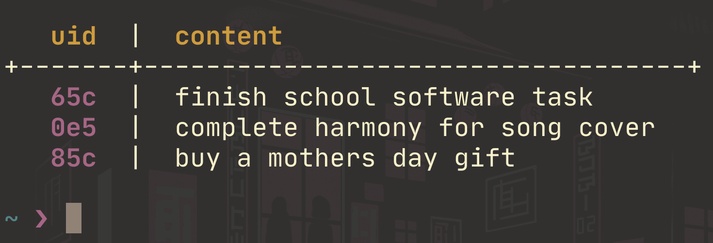

# eyecatch

eyecatch is a simple, eyecatching CLI TODO list that appears when you open a new terminal tab.



### Usage

```sh
eyecatch add "item" # adds item to the TODO
eyecatch delete <uid> # deletes the TODO matching the uid
eyecatch list # pretty prints all TODOs and uids
```

### Installation

1. Download the latest [release](https://github.com/amiyuki7/eyecatch/releases) binary
2. Create a symlink to somewhere recognisable in your `$PATH`

```sh
$ sudo ln eyecatch /usr/local/bin/eyecatch
```

3. Add it to your rc and source it

```sh
$ echo "eyecatch list" >> ~/.zshrc
$ source ~/.zshrc
```

### Building From Source

To compile eyecatch, you need Rust installed. eyecatch compiles with Rust 1.67.0 (stable) or newer.

```sh
$ git clone https://github.com/amiyuki7/eyecatch.git
$ cd eyecatch
$ cargo build --release
```

The binary is in `./target/release/eyecatch`, which you can then symlink.

### Data

All files generated by eyecatch will be in `$HOME/eyecatch/`
